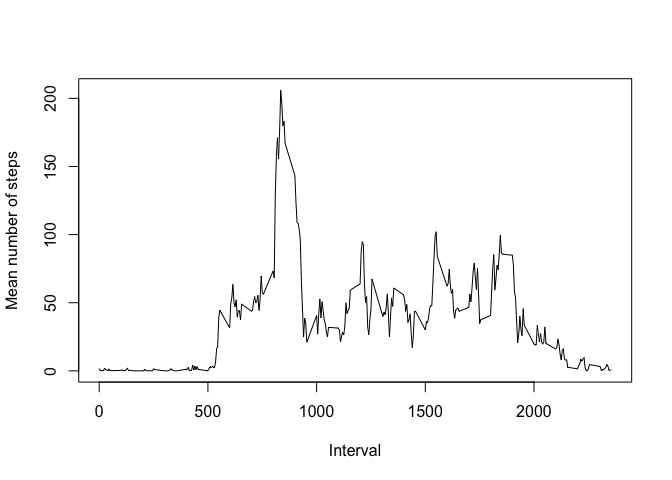
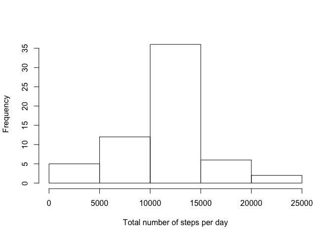

# Reproducible Research: Peer Assessment 1


## Loading and preprocessing the data

```r
library(dplyr)
```

```
## 
## Attaching package: 'dplyr'
## 
## The following object is masked from 'package:stats':
## 
##     filter
## 
## The following objects are masked from 'package:base':
## 
##     intersect, setdiff, setequal, union
```

```r
setwd("~/Documents/Coursera/DataScienceTrack/ReproducibleResearch/Project1")

data <- read.csv("activity.csv", header=TRUE, stringsAsFactors=FALSE)
data.complete <- data[complete.cases(data),]
```

## What is mean total number of steps taken per day?
Histogram of the total number of steps taken each day

```r
data.perday <- summarise(group_by(data.complete,date), tsteps=sum(steps), meansteps=mean(steps), medsteps=median(steps))
hist(data.perday$tsteps)
```

 

Mean total number of steps taken per day

```r
mean(data.perday$meansteps)
```

```
## [1] 37.3826
```
Median total number of steps taken per day

```r
median(data.perday$medsteps)
```

```
## [1] 0
```
## What is the average daily activity pattern?
Plot of average daily activity pattern

```r
data.interval <- summarise(group_by(data.complete,interval), meansteps=mean(steps))
plot(data.interval$interval, data.interval$meansteps, type="l")
```

 

5-minute interval, on average across all days in the dataset, containing maximum number of steps:

```r
data.interval[which.max(data.interval$meansteps), "interval"]
```

```
## Source: local data frame [1 x 1]
## 
##   interval
## 1      835
```

## Imputing missing values
Total number of rows with missing values in the dataset:

```r
nrow(data) - nrow(data.complete)
```

```
## [1] 2304
```

The strategy for filling in missing values in the dataset will be to use the mean for that 5-minute interval, using the following code:

```r
data.imp <- data
databy.means <- summarise(group_by(data, interval), meansteps=mean(steps, na.rm=TRUE))

for (i in 1:nrow(data.imp)) {
  if (is.na(data.imp[i,"steps"])) {
    interval <- data.imp[i,"interval"]
    data.imp[i,"steps"] <- databy.means[databy.means$interval==interval, "meansteps"]
  }
}
```
Histogram of the total number of steps taken each day

```r
dataimp.perday <- summarise(group_by(data.imp,date), tsteps=sum(steps), meansteps=mean(steps), medsteps=median(steps))
hist(dataimp.perday$tsteps)
```

 

Mean total number of steps taken per day

```r
mean(dataimp.perday$meansteps)
```

```
## [1] 37.3826
```
Median total number of steps taken per day

```r
median(dataimp.perday$medsteps)
```

```
## [1] 0
```

Notice that missing value imputation using the specified strategy resulted in no difference in the mean and median total number of steps taken per day, compared to the original dataset. The total number of steps did increase in the imputed data set, as can be seen by comparing the histograms for the original dataset and the imputed dataset.

## Are there differences in activity patterns between weekdays and weekends?

```r
data.complete$day <-weekdays(as.Date(data.complete$date))
data.complete$daytype <- ifelse((data.complete$day=="Sunday"), "weekend", "weekday")
data.complete$daytype <- ifelse((data.complete$day=="Saturday"), "weekend", data.complete$daytype)
data.complete$daytype <- factor(data.complete$daytype)
data.daytype <- summarise(group_by(data.complete, daytype, interval), meansteps=mean(steps))

library(lattice)
xyplot(data.daytype$meansteps~data$interval|factor(data.daytype$daytype), type="l")
```

 
